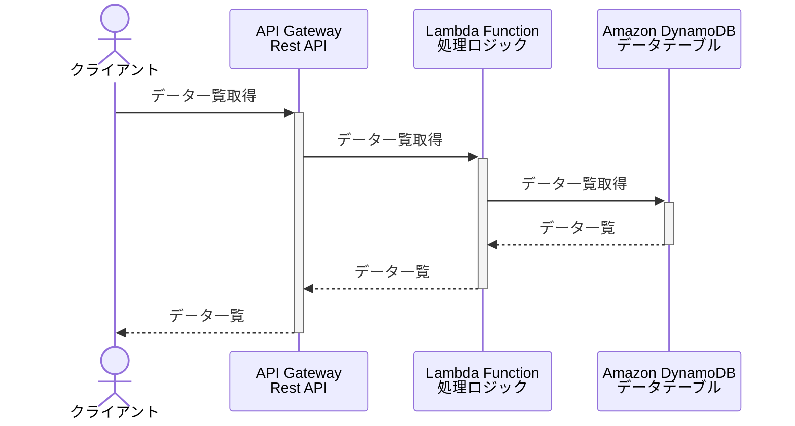

# AWS応用編
## サーバーレスサービス

- 従来型との比較
    - API Gateway: Webサーバー
    - Lambda: Appサーバー
    - DynamoDB: DBサーバー

## API Gateway
Lamdaなどの各種AWSサービスやVPCリソースに対してのAPIエンドポイントを提供するフルマネージド型サービス
認証機構、スロットリングやWAF機能、キャッシュ機能なども提供。

 - APIプロトコルの種類

    |種類|内容|
    |---|---|
    |REST|情報をURIで表現するリソースとして定義、HTTPメソッドで操作|
    |HTTP API| Lambda関数やコンテナのシンプルな外部API化|
    |WebSocket|クライアントとサーバー間の双方向通信を実現、一つのコネクションで継続的なデータ送受信|

- エンドポイントの種類

    |種類|内容|
    |---|---|
    |エッジ最適化|Publicに公開、一旦エッジロケーションにルーティング|
    |リージョン|Publicに公開、リージョンに直接ルーティング|
    |プライベート|Publicに非公開、VPC内からPrivateLink(VPCエンドポイント)経由のみアクセス|

## Lambda
**サーバーレス**コンピューティング
ほとんどすべての種類のアプリケーションやバックエンドのサービスコードを
管理作業を行うことなく実行可能。関数を定義してそれを呼び出すだけで使える。
- 実行時間は最長で15分。一つの実行要求毎に、一つの実行環境で実行される。
- 作成方法
    - 様々な言語（Java, Python, Rubyなど）で開発可能。
    - 開発環境: AWS 管理コンソール, AWS CloudFormation, AS SAM CLI, AWS CDK 
    - 非VPC Lambda(デフォルト）かVPC Lamdaか選択。VPC Lamdaの場合、VPC内のリソースにアクセスできる。
- 料金
    - 実行回数と消費リソースに基づく従量課金

## コンテナサービス
- **Amazon Elastic Container Service(Amazon ECS)**: コンテナ化されたアプリケーションを実行する。シンプルなAPIコールを利用してDocker対応アプリケーションを制御する。
クラウドでコンテナを本番環境利用するためのオーケストレーター。
    - タスク定義に基づき、コンテナ群が起動される。タスク内コンテナは同じホストで実行
- **Amazon Elastic Kubernetes Service (Amazon EKS)**: Kubernetes（コンテナ化されたアプリケーションを管理するプラットフォーム）を柔軟に開始、実行、スケーリングする。パッチ適用、ノードのプロビジョニング、更新を自動化する。
- **Amazon Elastic Container Registry(ECR)**: フルマネージドなプライベートコンテナイメージレジストリ。
Docker CLIから利用。ECS/EKS/Kubernetes以外の他コンテナオーケストレーションからも利用できる
- **AWS Fargate**: EC2インスタンスのプロビジョンやスケールなど管理扶養で、仮想マシンを意識せずコンテナをスケーリングできる。
    - 料金: コンテナの起動時間や使用リソースに応じた料金設定